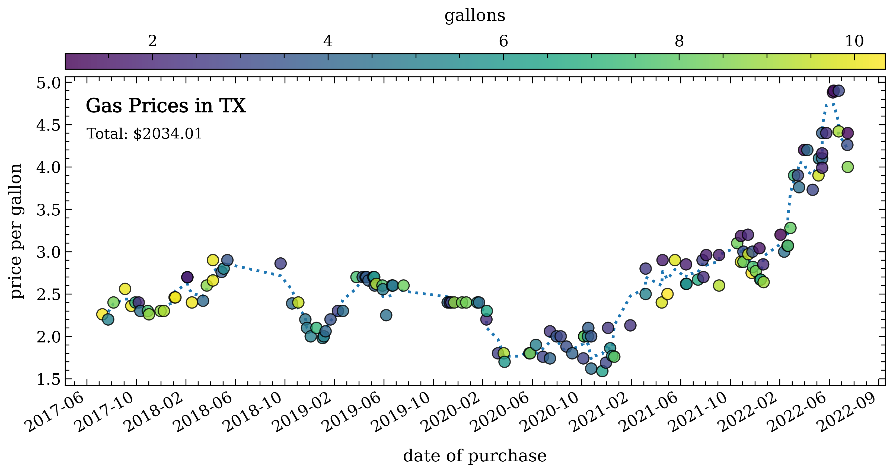
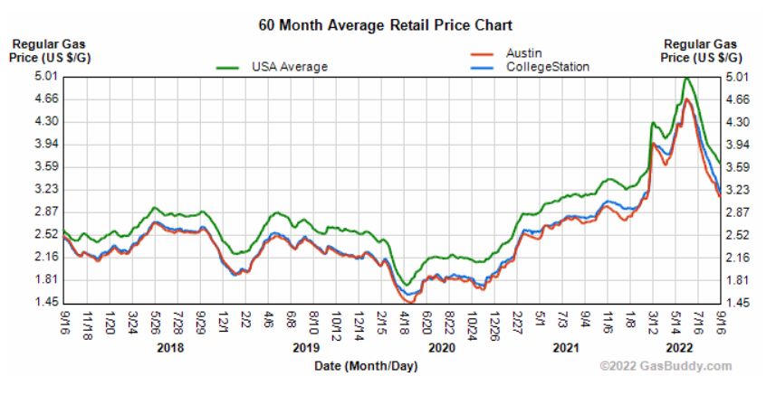

# gas-prices
Just some code I've written to track gas prices in Texas since I purchased my car in 2017.  Now that I've moved to work at NASA Goddard in Maryland, I've updated it to show the gas for either state!

### thought
>WHAT IF I made a basic android app that prompts me to log the gas price & amount of gallons -- then IT goes and adds it to my table of data for me?  This would save me from having to print my gas receipts all the time, which would be better for the environment... 🤔

.  
Here's the price-per-gallon as a function of time for Texas:  

For comparison, here's the current [gasbuddy chart](https://www.gasbuddy.com/charts) showing the rates for College Station, Austin, and the USA average covering the same time period:  

