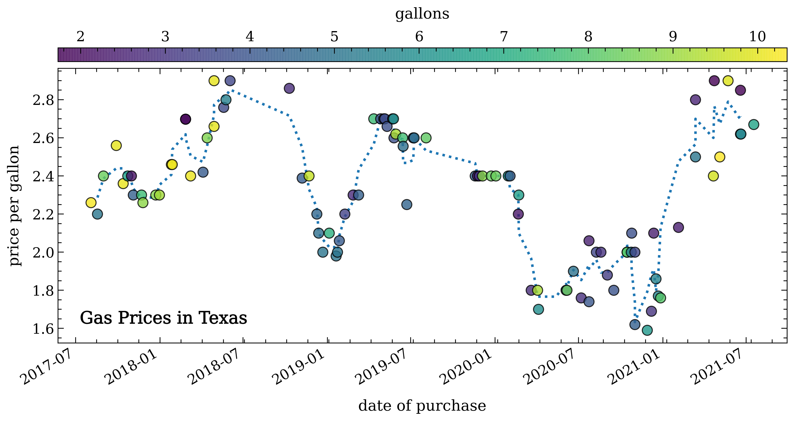
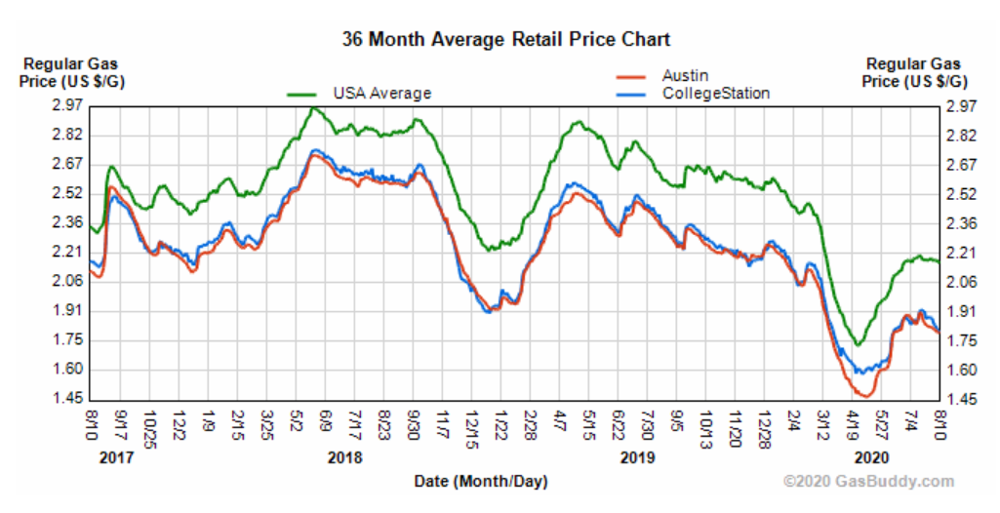

# gas-prices
Just some code I've written to track gas prices in Texas since I purchased my car in 2017. 

Here's the price-per-gallon as a function of time:

For comparison, here's the current [gasbuddy chart](https://www.gasbuddy.com/charts) showing the rates for College Station, Austin, and the USA average covering the same time period:

